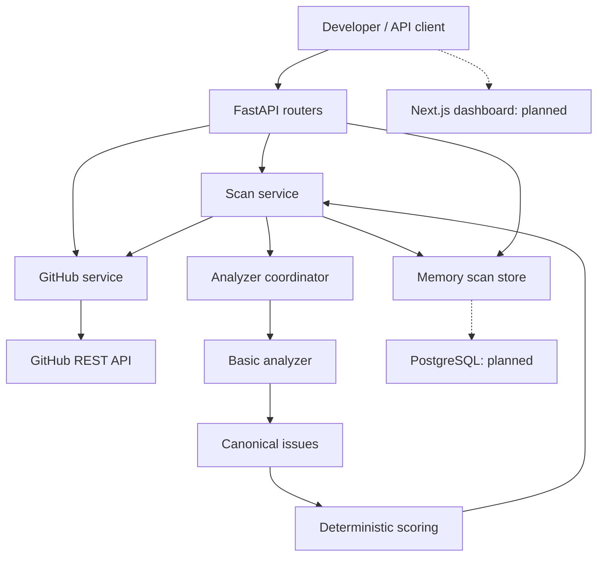

# DevProbe

DevProbe is an AI-assisted code review and CI quality platform.

It helps reviewers understand a pull request's size, potential problems, and test
changes before merging. The current implementation completes **Milestones 0–1**:
a modular FastAPI backend and a deterministic, synchronous GitHub PR scan.
The product dashboard and AI review are planned, not implemented.

## What works now

- Parse GitHub URLs and fetch repository metadata, contributors, commits, open
  PRs, and changed files, including nullable patches.
- Preserve the original API paths while providing the preferred route layout.
- Analyze added diff lines for possible credentials, debug output, TODO/FIXME,
  PR/file size, and application changes without test additions.
- Normalize findings, assign line numbers, and calculate an uncapped risk score.
- Create scans and retrieve metrics, findings, risk, timestamps, and failures.
- Keep source patches and matched values out of scan storage and logs.
- Handle pagination, size limits, safe redirects, timeouts, and bounded retries.

Findings are heuristics. They do not confirm vulnerabilities or measure test
coverage. A score of zero does not establish that code is safe.

## Stack and maturity

| Layer | Current | Later |
| --- | --- | --- |
| API | Python 3.12, FastAPI, Pydantic, requests | GitHub App credentials |
| Analysis | DevProbe basic analyzer and deterministic scoring | Bandit, Radon, ESLint, Semgrep |
| Storage | Thread-safe in-memory store, single process | PostgreSQL, SQLAlchemy, Alembic |
| Frontend | Existing Next.js 16 / React 19 / TypeScript / Tailwind starter | Product screens, shadcn/ui, Recharts |
| Review | Structured deterministic findings | OpenAI structured summaries |
| Execution | Synchronous scan service | Redis, Celery, isolated analysis workspaces |

## Architecture



`main.py` only composes the application. Routers parse/serialize HTTP requests;
the GitHub service owns all GitHub calls; the scan service owns the workflow;
the analyzer coordinator validates/deduplicates tool results; scoring is pure
business logic. The store uses copied snapshots and atomic claims.

`create_pending_scan()` and `execute_scan(scan_id)` separate creation from
execution. A future worker can invoke the same workflow after replacing the
memory store with shared durable persistence. Celery is not required now.

## Local setup

From the repository root, on macOS/Linux:

```bash
cd backend
python3.12 -m venv .venv
source .venv/bin/activate
python -m pip install -r requirements-dev.txt
cp .env.example .env
python -m uvicorn app.main:app --reload --host 127.0.0.1 --port 8000
```

Open [API documentation](http://127.0.0.1:8000/docs).

For runtime-only installation, use `requirements.txt`. Keep one API worker while
using memory storage. Restarting/reloading the process discards all scans.
Up to 1,000 scans are retained per process; further creations return 503.
There is no authentication or tenant isolation yet; this is a local prototype.

The original frontend starter can still run independently:

```bash
cd frontend
npm ci
npm run dev
```

It does not yet connect to the backend. No frontend changes are included here.

### Environment variables

Configuration is centralized in `backend/app/core/config.py`. It loads
`backend/.env`; existing environment variables take precedence.

| Variable | Default | Purpose |
| --- | --- | --- |
| `APP_ENV` | `development` | Environment label; does not enable production controls |
| `GITHUB_TOKEN` | Empty | Optional for public repos; private repo access requires an authorized server-side token |
| `GITHUB_TIMEOUT_SECONDS` | `10` | Read timeout; connection timeout is 3 seconds |
| `GITHUB_MAX_PAGES` | `30` | Maximum pages per list; each page requests up to 100 items |
| `GITHUB_MAX_RESPONSE_BYTES` | `8388608` | Maximum decoded bytes per GitHub response |

Never put the token in frontend variables or source control. `.env` variants are
ignored; `.env.example` contains no credentials. The GitHub API version is pinned
to `2022-11-28`. PostgreSQL/OpenAI/Redis configuration is deferred until used.

## Backend layout

```text
backend/
  app/
    main.py
    api/          # health, repositories, PRs, scans, compatibility, errors
    core/         # configuration and safe service exceptions
    schemas/      # repository, PR, changed file, issue, scan contracts
    services/     # GitHub, analyzer coordinator, risk, scan orchestration
    analyzers/    # basic text/diff analysis
    db/           # temporary scan storage
  tests/          # mocked network tests; no live GitHub quota consumption
  scripts/        # explicit live smoke test
```

## API endpoints

Repository requests use `{"repo_url": "https://github.com/owner/repo"}`.
`.git`, trailing slashes, and nested GitHub repository URLs are accepted.
Other hosts, credentials in URLs, and malformed repository paths are rejected.

| Method | Path | Response |
| --- | --- | --- |
| GET | `/health` | `{"status":"ok"}` |
| POST | `/repositories/parse-url` | `owner`, `repo` |
| POST | `/repositories/metadata` | Repository metadata and contributors |
| POST | `/repositories/commits` | `{"commits": [...]}` |
| POST | `/pull-requests` | `{"pulls": [...]}`; open PRs |
| POST | `/pull-requests/{pr_number}/files` | `{"files": [...]}` including nullable `patch` |
| POST | `/scans` | `{"scan_id": 1, "status": "completed"}` |
| GET | `/scans/{scan_id}` | Full persisted-in-memory scan snapshot |

### Compatibility and contract changes

The following aliases use the same handlers and response envelopes:

- `/repositories/parse-repo-url`, `/parse-repo-url`, `/analyze` → URL parsing.
- `/repositories/repo/metadata`, `/repo/metadata` → metadata.
- `/repositories/repo/commits`, `/repo/commits` → commits.
- `/repositories/repo/pulls`, `/repo/pulls` → PR list.
- `/repositories/repo/pulls/{pr_number}/files`, `/repo/pulls/{pr_number}/files`
  → changed files.

Aliases are marked deprecated in OpenAPI but remain available. `contributors`
is the normalized metadata key; commits, pulls, and files retain their envelopes.
Pagination now returns all pages within the configured bound. Hitting that bound
fails explicitly rather than returning an apparently complete partial result.

Validation is stricter: PR numbers must be positive integers; invalid URLs
return 400; invalid bodies return 422 without echoing submitted values. Rate
limits return 429 when identifiable from GitHub headers, permissions return
403, unavailable credentials return 401, missing resources return 404, and
transport failures return 503. Sanitized unexpected errors return 500.

### Run a scan

With the backend running:

```bash
curl -sS http://127.0.0.1:8000/scans \
  -H 'Content-Type: application/json' \
  -d '{"repo_url":"https://github.com/psf/requests","pr_number":7616}'

curl -sS http://127.0.0.1:8000/scans/1
```

Or run the live smoke script from `backend/`:

```bash
python scripts/smoke_scan.py https://github.com/psf/requests 7616
```

The service stores a pending scan, atomically marks it running, retrieves a
stable PR snapshot, analyzes, scores, and stores completion. Failed executions
retain their scan ID, safe failure reason, and timings. A failed creation after
allocation returns the mapped HTTP error plus `scan_id` and `status: failed`;
clients can retrieve that scan for details. Invalid input is rejected before
allocation.

Results include all requested issue-category counts, additions/deletions,
changed-file/line totals, risk, duration, timestamps, trigger source, head/base
SHAs, and patch availability warnings. The POST response already has the shape
needed for future asynchronous status polling.

## Analysis and risk scoring

The basic analyzer checks PRs with more than 15 files or 500 changed lines,
individual files with more than 250 changes, missing test additions, TODO,
FIXME, console.log, print(), and sensitive keywords. Line-level checks only
inspect added lines, with new-file line numbers across diff hunks. Deleted and
context lines do not generate new line findings.

Test recognition includes `test_`, `_test.`, `.test.`, `.spec.`, and `test/`,
`tests/`, or `__tests__/` directories. Test-only or documentation-only PRs do
not get missing-test findings. Deleting tests does not satisfy the heuristic.

| Finding / metric | Points |
| --- | ---: |
| Critical / high / medium / low security | 15 / 10 / 6 / 3 |
| Informational security keyword mention | 0 |
| High / medium complexity | 5 / 3 |
| Non-info style issue | 2 |
| Missing-test warning | 4 |
| Large file change | 2 |
| More than 15 files | 10 |
| 501–1000 changed lines | 10 |
| 1001+ changed lines | 20 instead of 10 |

TODO/FIXME and other unmapped findings currently add zero. PR-level size
findings are not scored a second time. Score bands are Low 0–20, Medium 21–50,
High 51–80, and Critical 81+. Scores are uncapped and labeled scoring version 1.
Complexity weights are supported, but the basic analyzer does not measure
complexity. Keyword-only matches are informational; a suspicious literal
assignment is a high-severity heuristic requiring manual verification.

Bandit, Radon, ESLint, Semgrep, and coverage execution remain future work. Tool
licenses and hosted-use terms must be reviewed before commercial deployment.

## Security and privacy

Repository code is never executed. The application does not clone or install
customer projects, run tests, load repository ESLint configuration, or invoke
shell commands from repository input. All source content is untrusted data.

Only GitHub API URLs receive the server token, including pagination/redirects.
There is one retry for transient transport/502/503/504 failures; permission and
rate-limit errors are returned without automatic retries. GitHub error bodies,
credentials, patches, and raw exceptions are excluded from client errors/logs.

Scans persist canonical findings and metrics, not patches, source snippets, or
matched literal values. Source exists only in memory during analysis. Missing
patches are disclosed. PRs above GitHub's 3,000-file limit, oversized responses,
and aggregate patches above 16 million characters fail explicitly. A changed
head/base SHA during retrieval also fails to avoid scoring a mixed snapshot.

The changed-files endpoint intentionally returns patches for the caller's live
inspection. Scan storage does not retain them. Authentication and tenant
ownership checks are prerequisites for any shared hosted deployment.

## Database direction

No SQLAlchemy models or migrations are implemented yet. Milestone 2 replaces
memory storage with PostgreSQL: Repository → PullRequest → Scan → Issues and
AIReview. Repositories will retain GitHub IDs; PRs will be unique by repository
and PR number. Organization ownership remains nullable until tenancy is added.
Do not run multiple API processes or introduce Celery with the memory store.

## Testing and measured results

From `backend/` with development requirements installed:

```bash
python -m pytest -q
python -m ruff check app tests scripts
python -m compileall -q app
```

The current change passes 139 tests. Network calls are mocked in the automated
suite. See [validation evidence](docs/VALIDATION.md) for exact commands, the
baseline startup failure, and a real HTTP scan of `psf/requests#7616`.
See the [audit and ordered implementation plan](docs/BUILD_AUDIT.md) for the
original repository assessment and acceptance criteria.

## Roadmap, Docker, and demo

1. **Done:** repair API composition and preserve route compatibility.
2. **Done:** deterministic basic scan pipeline and automated tests.
3. PostgreSQL, SQLAlchemy, and Alembic persistence.
4. Next.js repository, PR, scan result, and error/loading screens.
5. External analyzers, one at a time with safe runners and failure isolation.
6. Bounded structured OpenAI reviews with usage/cost tracking.
7. Scan history, trends, severity/category charts.
8. Redis/Celery using the existing workflow and persistent scan state.
9. Docker Compose and GitHub Actions.
10. GitHub App, verified webhooks, deduplicated checks/comments.
11. Authentication, organizations, tenant isolation, usage controls, then billing.

Docker/Compose and CI workflows are not included yet. The current demo is the
local API at [Swagger UI](http://127.0.0.1:8000/docs) and the smoke-test script.
No hosted demo or product screenshots exist yet; add them when the frontend
milestone is complete.

GitHub reference: [PR files and pagination limits](https://docs.github.com/en/rest/pulls/pulls#list-pull-requests-files),
[REST API best practices](https://docs.github.com/en/rest/using-the-rest-api/best-practices-for-using-the-rest-api).
